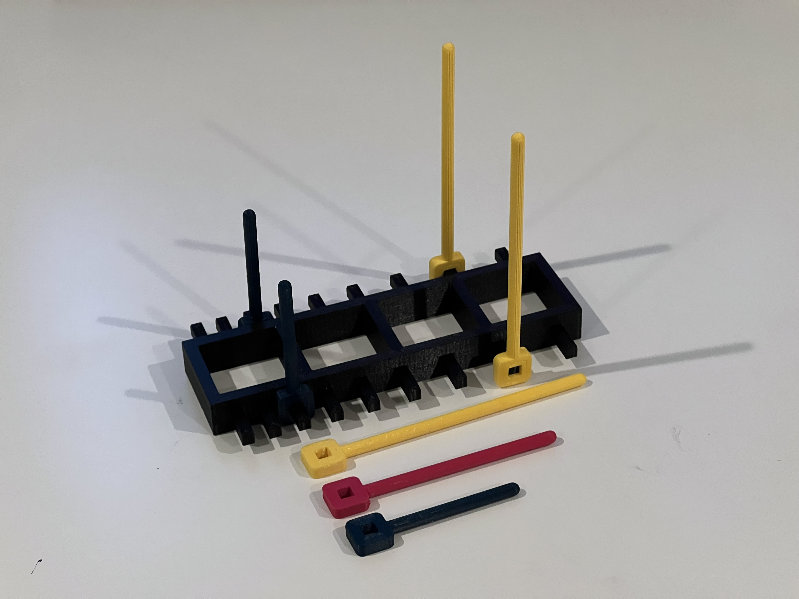

# Drone-RC-Holder
## Drone remote controller holder so I can let my drone fly hands-free.
`5cm Prong.stl`  
`7.5 cm Prong.stl`  
`10 cm Prong.stl`  
`RC Holder Base.stl`: Main frame where prongs could be attached to  
## Images
**Holder and Prongs**  
  